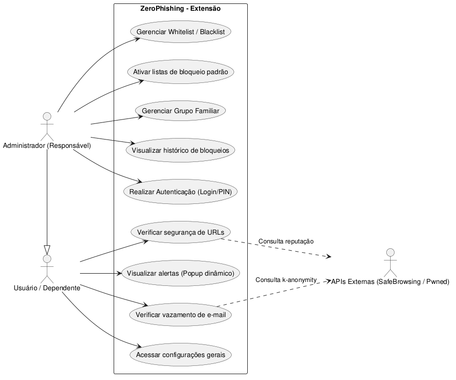
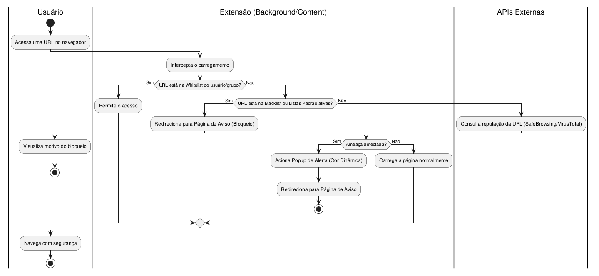
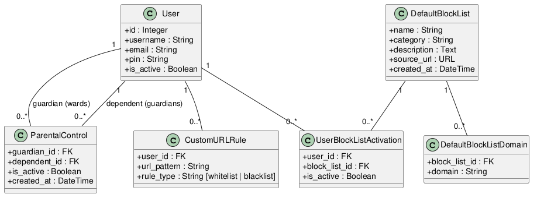

## Visão do Produto

| | |
|---|---|
| **Para** | Pessoas comuns e entusiastas de segurança que se preocupam com os sites que acessam e querem se proteger de golpes digitais, senhas roubadas e conteúdo inapropriado |
| **O** | ZeroPhishing |
| **É** | Uma extensão gratuita e transparente para o navegador que detecta sites falsos e links perigosos em tempo real, verifica se o seu e-mail já apareceu em vazamentos de dados na internet e permite que responsáveis controlem quais sites podem ser acessados |
| **Diferente de** | Ferramentas pagas e fechadas que escondem como funcionam e coletam seus dados sem avisar |
| **Nosso Produto** | Apresenta resultados claros e verificáveis, com uma interface simples para o dia a dia e detalhes técnicos para quem quiser se aprofundar |

---

## Diagrama de Caso de Uso

---

## BPD

---

## Diagrama de Classes

---

### Product Backlog (Sprints e Status)

| ID | Sprint | Título | Status |
| :--- | :--- | :--- | :--- |
| 1 | Sprint 1 | Verificar URL atual contra API de phishing | ✅ Fechado |
| 2 | Sprint 1 | Popup dinamico com Alerta visual ao detectar ameaça | ✅ Fechado |
| 3 | Sprint 1 | Redirecionamento para página de aviso | ✅ Fechado |
| 4 | Sprint 1 | Verificação de links em toda a pagina ao carregar | ✅ Fechado |
| 6 | Sprint 2 | Verificação de e-mail para vazamentos | ✅ Fechado |
| 7 | Sprint 2 | Login de usuario | ✅ Fechado |
| 8 | Sprint 2 | Adição de WhiteList e Blacklist | ✅ Fechado |
| 9 | Sprint 3 | Adição de listas de bloqueios padrões | ✅ Fechado |
| 10 | Sprint 3 | Adição de grupo familiar | ✅ Fechado |
| 11 | Sprint 3 | Histórico de sites blocked | ✅ Fechado |
| 12 | Sprint 4 | Pagina de configuração do usuario | ✅ Fechado |
| 13 | Sprint 4 | Dashboard de bloqueios | ✅ Fechado |

### Detalhes de Épicos e User Stories (Mapeamento)

| ID | Título | Épico | User Story / Descrição |
| :--- | :--- | :--- | :--- |
| 1 | Verificar URL atual contra API de phishing | E2 - Proteção de Navegação | US: Como usuário, quero que a extensão verifique automaticamente a URL atual contra uma API de phishing/malware ao carregar qualquer página. |
| 2 | Popup dinamico com Alerta visual ao detectar ameaça | E2 - Proteção de Navegação | US: Como usuário, quero ver um alerta visual no popup da extensão quando o site atual for detectado como malicioso. |
| 3 | Redirecionamento para página de aviso | E2 - Proteção de Navegação | US: Como usuário, quero ser redirecionado a uma página de aviso antes de acessar um site malicioso para ter a opção de sair ou prosseguir consciente. |
| 4 | Verificação de links em toda a pagina ao carregar | E2 - Proteção de Navegação | US: Como usuário, quero que links na página sejam verificados, mostrando algum sinal de segurança do link, antes do clique para eu saber antecipadamente se são seguros. |
| 6 | Verificação de e-mail para vazamentos | E3 - Verificação de Vazamentos | US: Como usuário, quero digitar meu e-mail no popup e ver se ele apareceu em algum vazamento de dados, com a lista de serviços afetados, data e tipos de dados expostos. |
| 7 | Login de usuario | E4 - Controle de Acesso | US: Como administrador, quero me autenticar na extensão com senha/PIN para acessar as configurações de controle de acesso. |
| 8 | Adição de WhiteList e Blacklist | E4 - Controle de Acesso | US: Como administrador, quero adicionar e remover URLs WhiteList/BlackList personalizada para bloquear ou liberar sites específicos. |
| 9 | Adição de listas de bloqueios padrões | E4 - Controle de Acesso | US: Como administrador, quero ativar listas padrão de bloqueio por categoria (adulto, malware, redes sociais) para aplicar restrições com um clique. |
| 10 | Adição de grupo familiar | E4 - Controle de Acesso | US: Como administrador, quero criar e gerenciar um grupo familiar, associando outros usuários para aplicar restrições individuais de acesso. |
| 11 | Histórico de sites bloqueados | E4 - Controle de Acesso | US: Como administrador, quero visualizar o histórico de tentativas de acesso bloqueadas com data, hora, URL e usuário. |
| 12 | Pagina de configuração do usuario | E5 - Configurações do Usuário | US: Como usuário, quero um local onde consiga gerenciar as minhas configurações da extensão |
| 14 | Dashboard de bloqueios | E6 - Relatórios e Visibilidade | US: Como administrador, quero visualizar gráficos e estatísticas dos bloqueios: total por período, distribution por categoria, top URLs bloqueadas e bloqueios por usuário do grupo familiar. |